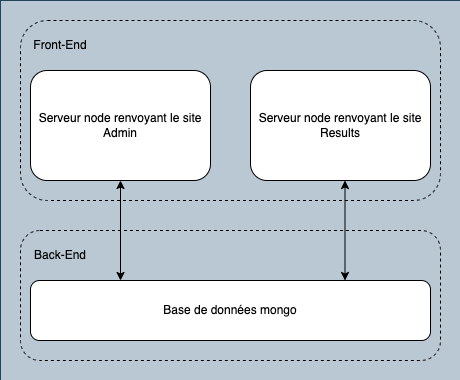
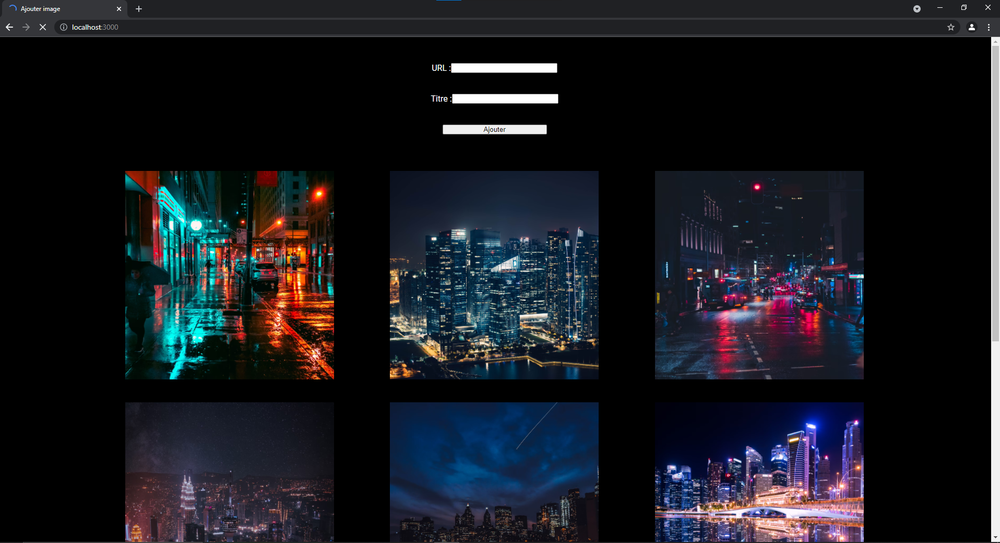
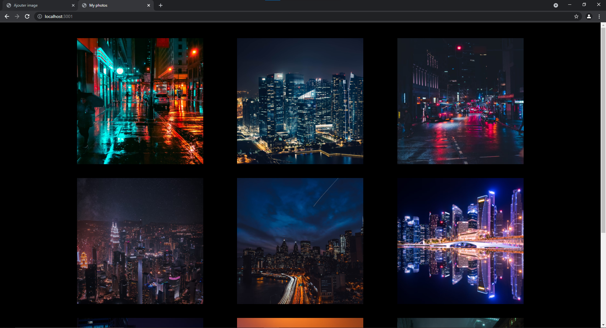
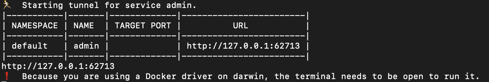
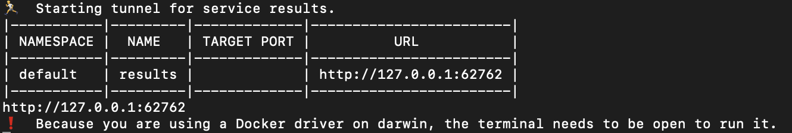

# Prérequis

Nous allons ici procéder en 2 étapes:

- Dans un premier temps lancer nos 2 applications avec docker-compose
- Dans un second temps lancer nos 2 applications avec kubernetes. Nous utiliserons ici Minikube

Vous pouvez installer minikube ici :

https://kubernetes.io/fr/docs/tasks/tools/install-minikube/

Voici notre architechture finale:



# Lancement de l'application Docker

Lancer la commande suivante dans le terminal:

```shell
docker-compose up
```

Une fois l'application lancée, allez sur le lien suivant :

[localhost sur le port 3000 pour charger la base de données puis pour ajouter des photos](localhost:3000)

Si vous voulez visualiser uniquement les photos ajoutées :

[localhost sur le port 3001 pour visualiser uniquement les images](localhost:3001)

Attention, la page results sur le port 3001, sera vide si on est pas d'abord aller sur la page admin, qui remplis la base de données mongo avant d'avoir la page d'admin

Vous devriez alors obtenir quelque chose comme ceci :

Pour le port 3000 :



Pour le port 3001 :



# Lancement application Kubernetes

Il faut dans un premier temps faire attention à avoir (si vous êtes sous Windows) Kubernetes d'activer.

Il faut ensuite lancer la commandes suivantes pour demarrer minikube :

``` shell
minikube start
```

Cette commande lancera le cluster.

Puis lancer :

``` shell
kubectl apply -f kubernetes_files
```

Cette commande lancera tous les pods nécessaire à l'exécution de notre application, on pourra ainsi voir qu'ils sont tous dans le bon état avec la commande :

``` shell
kubectl get po
```
Une fois que tous les pods ont le status `running`, alors on peut passer à la suite.


Pour trouver les URLS de nos services (dans 2 terminals différents):

``` shell
minikube service admin --url
minikube service results --url
```





Vous pouvez alors accéder aux 2 applications. N'oubliez pas d'acceder d'abord à l'application admin, qui va remplir la base de données avant de voir des photos sur la page results
